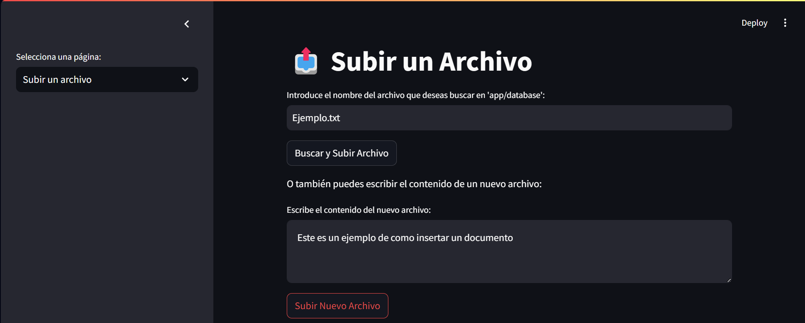
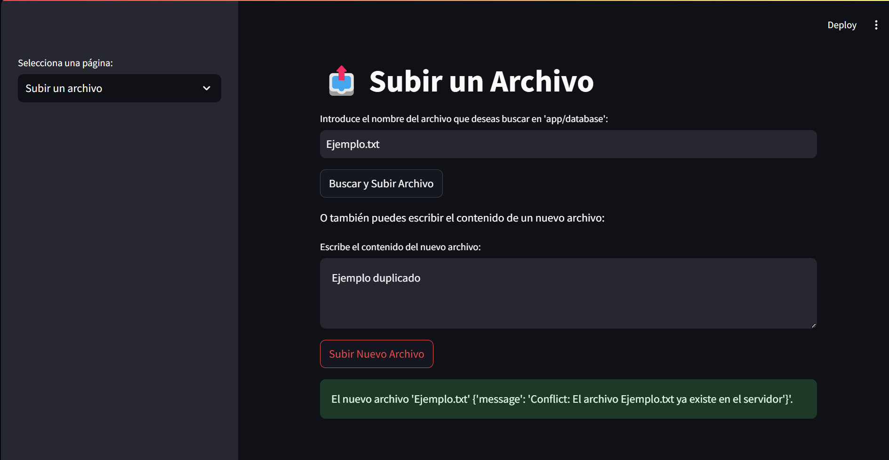

Para correr el proyecto

- Construir la imagen de docker 
- Levantar el docker compose
  - ``` docker-compose up -d ```
  
- levantar los nodos
    - 
    ```
    docker exec -it  node_{$i}  bin/bash

    ```
    - 
    ```
    python app/code/server.py
    ```
    - levantar cliente:
   
    ```
    docker exec -it  client_1  bin/bash
    ```
- Se recomienda 3  o mas para garantizar resistencia >=2
- en el cliente ```streamlit run app/code/index.py```
- en los contenedores server ```python app/code/server.py```
- Las base de datos se linkean directamente en cada contenedor
- Los logs analogamente
- Recordar que en el server en la parte de if __name__ se puede cambiar las configuraciones
- Tener activado el server de embeddings de lmstudio
- Si se cambia de generador de embeddings
- ir a distributed/helper/embedding_generator.py y mirar la ````api client = OpenAI(base_url="http://host.docker.internal:1234/v1", api_key="lm-studio") ````o la que se vaya a usar.

# Estrutura del proyecto:
El proyecto representa un sistema de búsqueda distribuido, en el permite la insercción, eliminación, modificación y búsqueda de estos archivos, para ello se proporciona una interfaz gráfica realizada en streamlit con el objetivo de brindar un entorno intuitivo y transparente al uso de la solución. 
Los documentos a añadir deben de tener un nombre y una extensión (En caso de no brindarse esta, la extensión por defecto será *PlainText*)    
No pueden existir dos documento con igual nombre(incluye la extensión ). .
Los archivos tanto el nombre como el texto plano, se enviarán hacia algun servicio que genere un embedding para poder crear un *SRI* basado en este.

- Interfáz Gráfica:
La interfaz gráfica es el cliente el cual brindará todas las opciones de nuestro servidor de manera transparente de cara al cliente, en ningún momento este sabrá que es un sistema distribuido. Se brinda una página web generada con streamlit. 
- Backend:
  El backend está compuesto por una serie de servidores distribuidos, donde todos tienen las mismas condiciones, osea pueden procesar los pedidos, se utiliza la arquitectura Chord para estos.
  La arquitectura distribuida como se menciona anteriormente fue Chord dado que es sencilla y ademas muy poderosa, al ser una *DHT* distribuida permite que a cada nodo le asignemos como dueño de solo un grupo de archivos, los cuales se selecciona al computar el hash al nombre completo del archivo, se utiliza *SHA-1*, por las mismas bondades función de mapeo hace que la carga de los nodos este balanceada a medida que crece el volumen de carga, cada nodo tiene el grupo de documentos del cual es dueño, más un grupo de estos el cual sirve como replica, existe la posibilidad de replicar hasta en N nodos, en la configuración del server, por ello para realizar operaciones que modifiquen el estado de la base de datos es necesario de cumplir con el mínimo de nodos, osea *Cantidad de nodos réplica + 1*.
  
  Nuestro proyecto es un proyecto multicapa:
  - Nodo de Chord:
   Esta capa es la más elemental tiene toda la lógica de ser un nodo de chord, como unirse a la red y poder reconocer cuales son las llaves que pertenece a cada nodo.
  - Gestión del líder:
   En esta capa se gestiona, la elección y sincrinización con respecto al lider, además de la gestión del servidor de nombres para las url internas de cada nodo. 
  - Guardado de información:
   En esta capa se gestiona la posesión de un servidor por cada nodo, con la posibilidad de poder almacenar información, así como encargarse de replicarla.
 - Sincronización de la información:
   En esta capa se gestiona como se comporta la red una vez hay una variación en la estrutura de la misma para asegurar la consistencia de la misma.
  - Base de datos distribuida:
   En esta capa se tiene en cuenta que desde cualquier nodo de chord desde el que acceda el cliente será capaz de redireccinar al dueño de la información para que haga las operaciones pertinentes, así como tener la lógica de como resolver los problemas causados por la misma posible desestabilización de la red
  - Buscador distribuido: 
   En esta capa se tiene utiliza la misma base de datos distribuida para guardar la información asi como hacer los servicios de creación de los embeddings, asi como de los objetos a guardar en la base de datos, y poder procesar query.
  - Servidor:
  Gestiona y sincroniza como un todo el buscador distribuido, añadiendo la url [search.search](search.search) al servidor de nombres para que el cliente pueda acceder a la red como primera forma, ademas en todo momento tanto para el cliente y como los nodos, se guarda una caché de al menos 3 nodos de la red cada cierto tiempo, así como de realizar broadcast como última opción.
